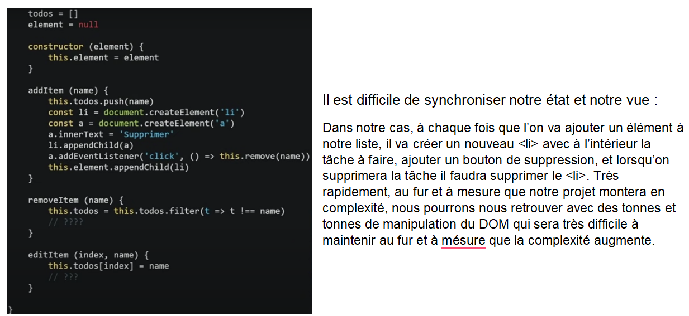
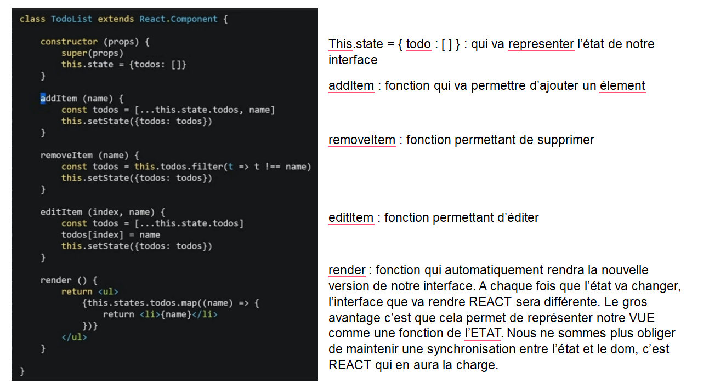

# Module 1 – Introduction à React JS 19

## Objectifs du module

À l’issue de ce module, vous serez capable de :

- Comprendre ce qu’est **React JS** et ses **principes fondamentaux** ;
- Identifier les **différences entre une bibliothèque et un framework JavaScript** ;
- Savoir **pourquoi React est si populaire** dans le développement front-end moderne ;
- Créer votre **première application React** en mode développement ;
- Comprendre les **bases de JSX** et le **rendu du DOM virtuel**.

---

## Qu’est-ce que React JS ?

**React JS** est une **bibliothèque JavaScript** développée par **Facebook** (Meta) en 2013.Elle permet de créer des **interfaces utilisateur dynamiques** pour :

- des **applications web monopages (SPA)**,
- ou des **applications mobiles multiplateformes** via **React Native**.

> React se concentre sur la **construction de la vue** (le “V” du modèle MVC), en rendant le code plus modulaire, maintenable et performant.

---

## Bibliothèque vs Framework

| **Aspect**           | **Bibliothèque JavaScript (ex : React)**               | **Framework JavaScript (ex : Angular, Vue)**   |
| -------------------------- | ------------------------------------------------------------- | ---------------------------------------------------- |
| **Structure**        | Fournit des outils spécifiques sans imposer une architecture | Fournit une structure complète et des conventions   |
| **Liberté**         | Grande flexibilité : on choisit ce qu’on veut utiliser      | Plus rigide : impose une façon de coder             |
| **Rôle**            | Se concentre sur la vue et la gestion du DOM                  | Gère l’ensemble du cycle de vie d’une application |
| **Exemple d’usage** | Intégrable dans un projet existant                           | Requiert de suivre la logique du framework           |

---

## Pourquoi utiliser React ?

- 🔹 **Simplicité** : une approche claire basée sur les composants.
- 🔹 **Performance** : grâce au **Virtual DOM**, seules les parties modifiées de la page sont re-rendues.
- 🔹 **Écosystème riche** : de nombreuses bibliothèques, outils et communautés actives.
- 🔹 **JSX** : une syntaxe intuitive combinant HTML et JavaScript.
- 🔹 **Réutilisabilité** : les composants sont modulaires et peuvent être partagés entre projets.

---

## Problème que résout React

En JavaScript classique, maintenir la synchronisation entre **l’état (data)** et la **vue (DOM)** devient vite complexe.React introduit une approche déclarative :

> 🧩 *La vue est une fonction de l’état.*

Lorsque **l’état change**, React **re-render** automatiquement la partie concernée, sans intervention manuelle sur le DOM.

Exemple :

JavaScript

React (old version)

