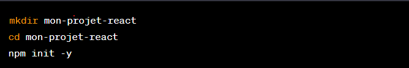
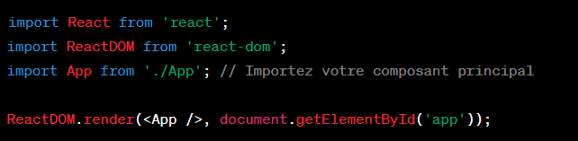
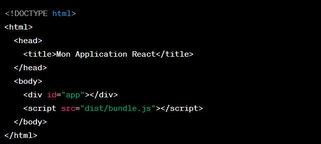

### Configuration React

Configurer votre propre configuration React sans utiliser Create React App nécessite un peu plus de travail, mais cela vous donne un contrôle total sur la configuration de votre projet. Voici les étapes générales pour créer votre propre configuration React.

1-Initialisez un nouveau projet Node.js si vous n'en avez pas déjà un. Vous pouvez le faire en exécutant la commande suivante dans votre terminal :

2-Installez les dépendances nécessaires pour React et Babel. Vous aurez besoin de dépendances telles que `react`, `react-dom`, `babel-loader`, `@babel/core`, `@babel/preset-react`, `webpack`, et `webpack-cli`. Vous pouvez les installer avec npm ou yarn :

*npm install react react-dom
npm install -D babel-loader @babel/core @babel/preset-react webpack webpack-cli*

*npm install --save-dev @babel/preset-env*

La commande `npm install -D babel-loader @babel/core @babel/preset-react webpack webpack-cli` installe plusieurs packages en tant que dépendances de développement dans votre projet. Voici une explication de chaque package :

* `babel-loader` : C'est un chargeur pour Webpack qui transpile votre code JavaScript moderne en code JavaScript qui peut être exécuté dans les navigateurs plus anciens. Il utilise Babel et webpack pour cela.
* `@babel/core` : C'est le package principal de Babel, un compilateur JavaScript qui est principalement utilisé pour convertir le code ECMAScript 2015+ en une version de JavaScript compatible avec les navigateurs actuels et plus anciens.
* `@babel/preset-react` : C'est un ensemble de plugins utilisés par Babel pour transformer le code JSX et ES6+ en code JavaScript ES5.
* `webpack` : C'est un module bundler. Son travail principal est de regrouper les fichiers JavaScript pour une utilisation dans un navigateur, mais il peut aussi transformer, regrouper ou empaqueter à peu près n'importe quelle ressource ou actif.
* `webpack-cli` : C'est l'interface en ligne de commande pour webpack. Il permet d'utiliser webpack à partir de la ligne de commande, ce qui est utile pour les scripts de build et pour le développement.

En résumé, cette ligne installe les outils nécessaires pour configurer un environnement de développement qui peut transformer le code React (JSX et ES6+) en code JavaScript qui peut être exécuté dans le navigateur, et regrouper tous les fichiers JavaScript en un seul fichier pour une utilisation dans le navigateur.

3-Créez un fichier de configuration pour Webpack (`webpack.config.js`) à la racine de votre projet.

4-Créez un dossier `src` à la racine de votre projet et à l'intérieur, créez un fichier `index.js`. C'est le point d'entrée de votre application React. Vous pouvez y importer et rendre vos composants React:

5-Créez les composants React nécessaires dans le dossier `src`.

6-Créez un fichier HTML dans lequel vous inclurez le point d'entrée de votre application. Par exemple, créez un fichier `index.html` à la racine de votre projet :

7-Dans votre fichier `package.json`, ajoutez des scripts pour faciliter le développement et la construction de votre application. Par exemple :

8-Exécutez la commande `npm start` pour lancer votre application React en mode développement. Cela devrait ouvrir votre application dans un navigateur.

9-Exécutez la commande `npm run build` pour créer une version optimisée de votre application pour la production. Les fichiers de production seront généralement dans un répertoire `dist` ou `build`, comme spécifié dans votre fichier de configuration Webpack.

Ces étapes de base vous permettront de créer une configuration React personnalisée. Vous pouvez ensuite personnaliser davantage votre configuration en fonction des besoins de votre projet.
